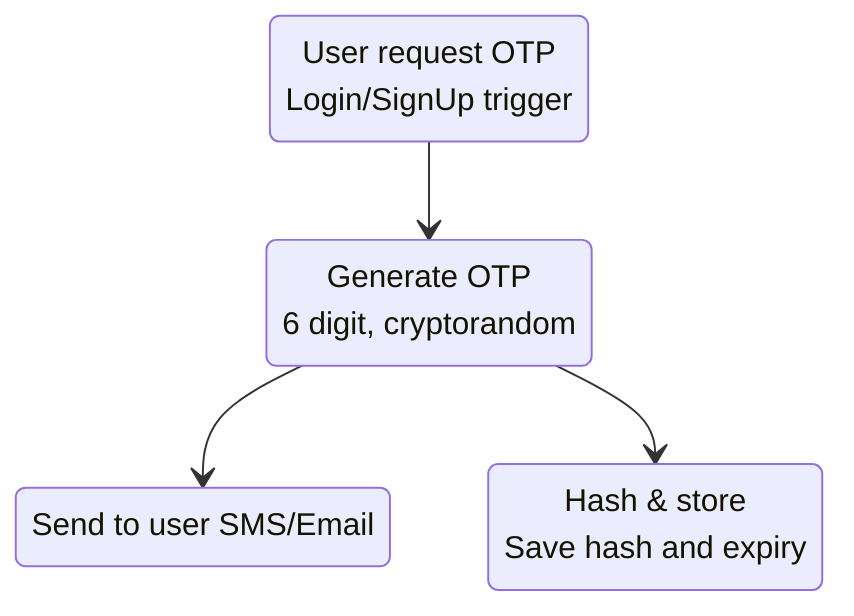
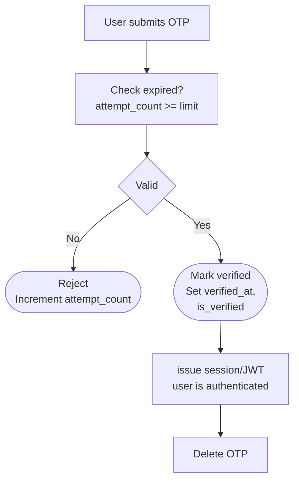
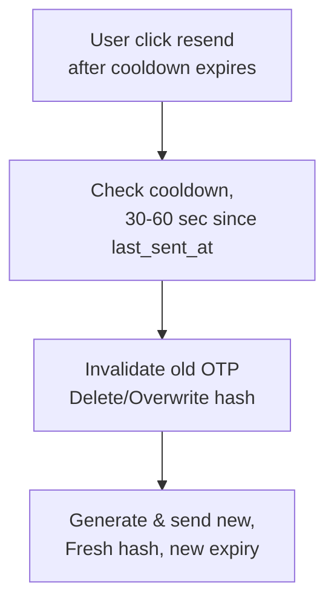

# OTP

Source: [**OTP System Design**](https://www.instagram.com/p/DZICSXUEn-e)

Tags: **[]**

# Index

- [**What is?**](#whats-it)
- [**Main applications**](#main-applications)
- [**Advantages**](#advantages)
- [**Disadvantages**](#disadvantages)
- [**Inner function**](#inner-function)
  - [**Where does the OTP live?**](#where-does-the-otp-live)
  - [**Redis vs DB**](#redis-vs-db)
  - [**Workflows**](#workflows)

# What´s it?

# Main Applications

OTP's help verify users during:

- Sign up.
- Login.
- Password reset.
- Sensitive actions.

# Advantages

# Disadvantages

# Inner Function

## Where Does The OTP Live?

Is usually stored in:

- A dedicated OTP table.
- Redis with an expiration time (TTL).

Note:

- Never store the raw OTP.
- Store only a hashed version of the OTP.

## Redis vs DB

### Redis

- Extremely fast reads and writes.
- Built-in expiration (TTL).
- Automatically removes expired OTPs.
- Ideal for temporary data like OTPs.

### DB

- Is persistent.
- Require manual cleanup of expired OTPs.
- Useful for auditing and reporting.

## Workflows

### OTP Generation And Delivery

### Verification Flow

### Resend OTP

